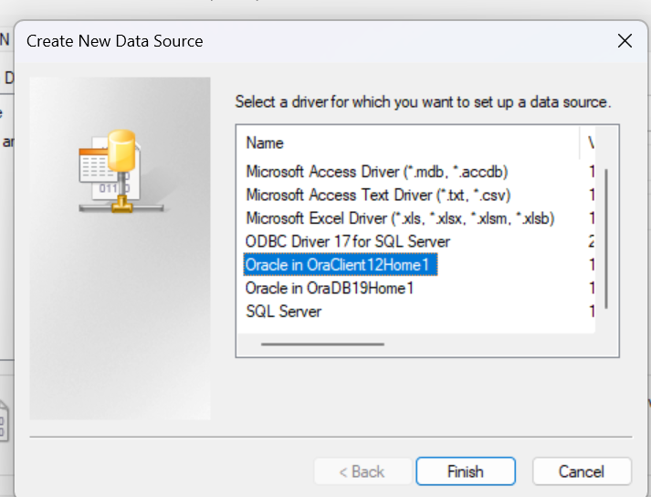
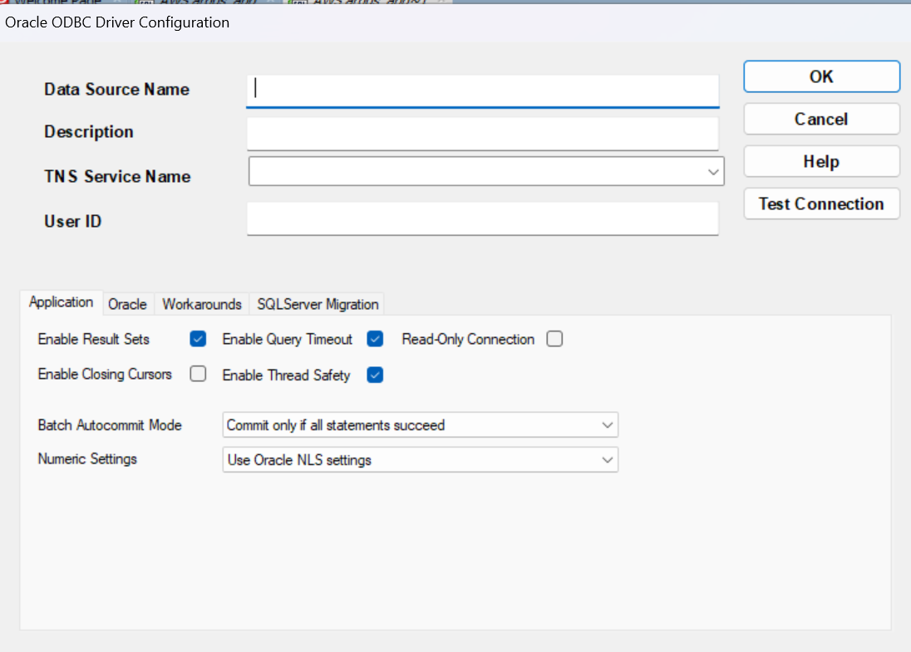
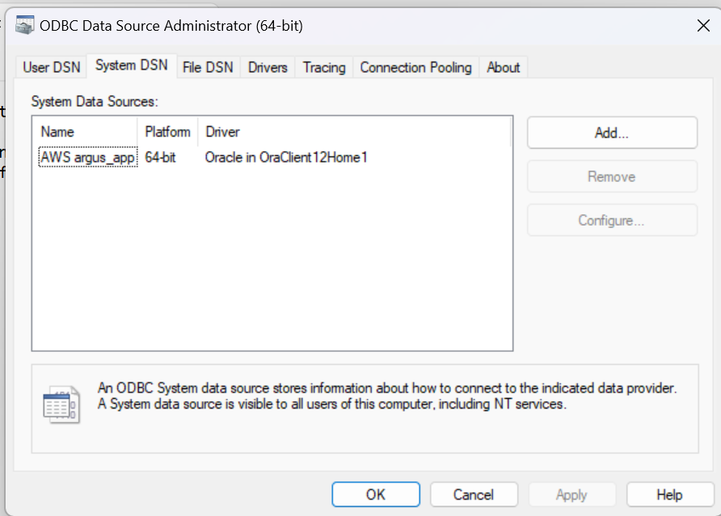
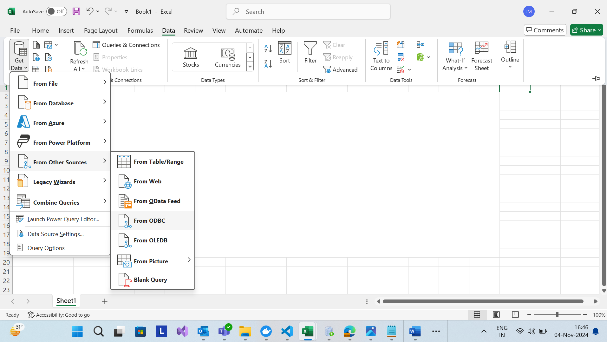
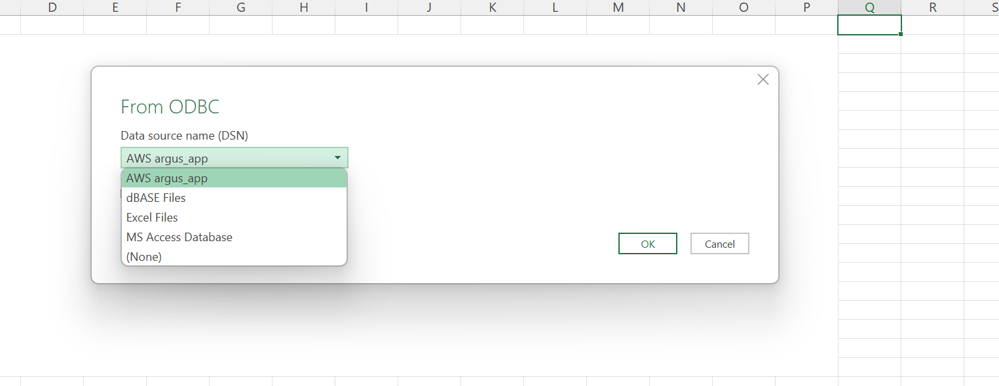

# Steps to Set Up Oracle Client (works with Oracle Instant Client as well) Connection with ODBC driver and Access Data from Excel 

## Step 1: Download Oracle Instant Client Files
1. Download the following files from the Oracle Instant Client downloads page:
2. instantclient-basic-windows.x64-19.24.0.0.0dbru.zip
3. instantclient-odbc-windows.x64-19.24.0.0.0dbru.zip

## Step 2: Create Installation Folder
1. Create a new folder in the C: drive and name it oracle.
2. Inside the C:\oracle folder, unzip both downloaded files. You should now have two folders:
   * C:\oracle\instantclient-basic-windows.x64-19.24.0.0.0dbru
   * C:\oracle\instantclient-odbc-windows.x64-19.24.0.0.0dbru

## Step 3: Consolidate Files
1. Go to C:\oracle\instantclient-odbc-windows.x64-19.24.0.0.0dbru\instantclient_19_24.
2. Copy all files in this folder.
3. Paste them into C:\oracle\instantclient-basic-windows.x64-19.24.0.0.0dbru\instantclient_19_24 to have all necessary files in one location.

## Step 4: Create the TNSNAMES.ORA File
1. In the C:\oracle\instantclient-basic-windows.x64-19.24.0.0.0dbru\instantclient_19_24 folder, create a new file named tnsnames.ora.
2. Replace YOUR_DB_ALIAS with a name for this connection (e.g., ORCL).
3. Replace your_db_host, your_db_port, and your_service_name with the appropriate values for your database connection. 
 

## Step 5: Set Up Environment Variables
1. Add ORACLE_HOME:
    * Click on New under System variables.
    * Set Variable Name to ORACLE_HOME.
    * Set Variable Value to C:\oracle\instantclient-basic-windows.x64-19.24.0.0.0dbru\instantclient_19_24.
    * Click OK.

2. Update the PATH Variable:
    * In System variables, find the Path variable and select Edit.
    * Click New and add the path to the Instant Client directory (C:\oracle\instantclient-basic-windows.x64-19.24.0.0.0dbru\instantclient_19_24)
    * Click OK to close all Environment Variables windows.

3. Add TNS_ADMIN:
	* Click on New under System variables.
	* Set Variable Name to TNS_ADMIN.
	* Set Variable Value to C:\oracle\instantclient-basic-windows.x64-19.24.0.0.0dbru\instantclient_19_24.
	* This ensures that Oracle tools can find the tnsnames.ora file.

4. Click New again to add a second variable:
    * Variable Name: NLS_LANG 
    * Variable Value: ENGLISH_FRANCE.JA16SJIS 

## Step 6: Install the ODBC Driver
1. Open Command Prompt as Administrator:
    * Click Start, type cmd, right-click on Command Prompt, and select Run as administrator.

2. Navigate to the Instant Client Directory:
   * In Command Prompt, enter the following command
   * cd C:\oracle\instantclient-basic-windows.x64-19.24.0.0.0dbru\instantclient_19_24

3. Run the ODBC Installer:
   * Run the following command to install the ODBC driver:
   * odbc_install.exe

## Step 7: Configure the ODBC Data Source
1. Open ODBC Data Source (64-bit) Administrator on your computer (you can search for "ODBC" in the   Start menu).
2. Go to the System DSN tab.
3. Click Add to create a new data source.
4. Select Oracle Client as the driver for the data source. 
 
5. In the setup window, enter the following details
   * Data Source Name: Give a name to your data source (e.g., "AWS argus_app_").
   * Description: (Optional) Enter a brief description of the data source.
   * TNS Service Name: Enter the TNS alias that corresponds to your database.
   * User ID: Enter your database user ID. 
 
6. Click Test Connection and, when prompted, enter your Oracle password to ensure the connection works. Once successful, save this data source configuration. 
 
			
## Step 8: Connect to Oracle Database in Excel
1. Open Excel and navigate to the Data tab in the ribbon.
2. Click Get Data > From Other Sources > From ODBC. 
 
3. From the list of available ODBC data sources, select the data source you just created. 
 
4. When prompted, enter your Oracle database credentials to establish a connection. 
5. After connecting, you are now ready to import data from the Oracle database directly into  Excel. 
	
